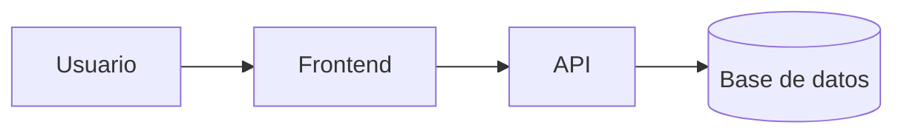

# # Laboratorio README


Proyecto práctico para aprender herramientas avanzadas de documentación en GitHub.

---

## Índice
* [Instalación](#instalación-y-uso)
* [Estado del Proyecto](#estado-del-proyecto)
* [Arquitectura](#arquitectura)
* [Contribuidores](#contribuidores)

---

## Instalación y Uso

```bash
# Clonar el proyecto localmente
git clone https://github.com/michaelburgos-ship-it/laboratorio-readme.git

# Ejecutar la aplicación
npm start
```

---

## Estado del Proyecto

### Tabla de funcionalidades

| Función | Estado |
| :--- | :--- |
| Login | Listo |
| Reportes | En progreso |

### Pendientes
- [x] Diseño de la base de datos
- [ ] Pruebas unitarias

---

## Arquitectura



---

## Contribuidores

* **Burgos Charcas Michael Josué René** - [@michaelburgos-ship-it](https://github.com/michaelburgos-ship-it)
